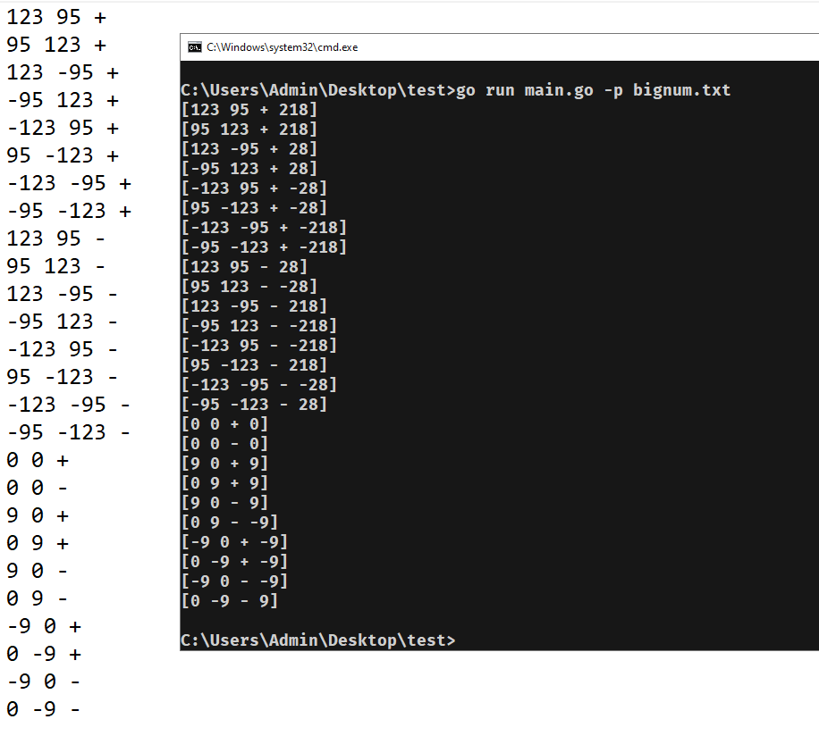
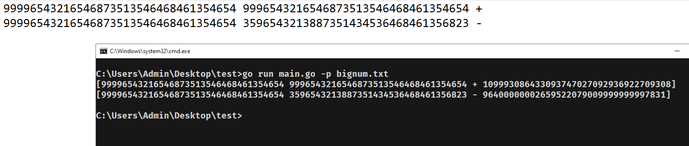

# ADD/SUB big number
A script to add/substract big number.
## Usage
run command
```
go run main.go -p=your_path_file
```
Or
```
go run main.go -p your_path_file
```
## Demo
Test add/sub function.

Test by big numbers.

